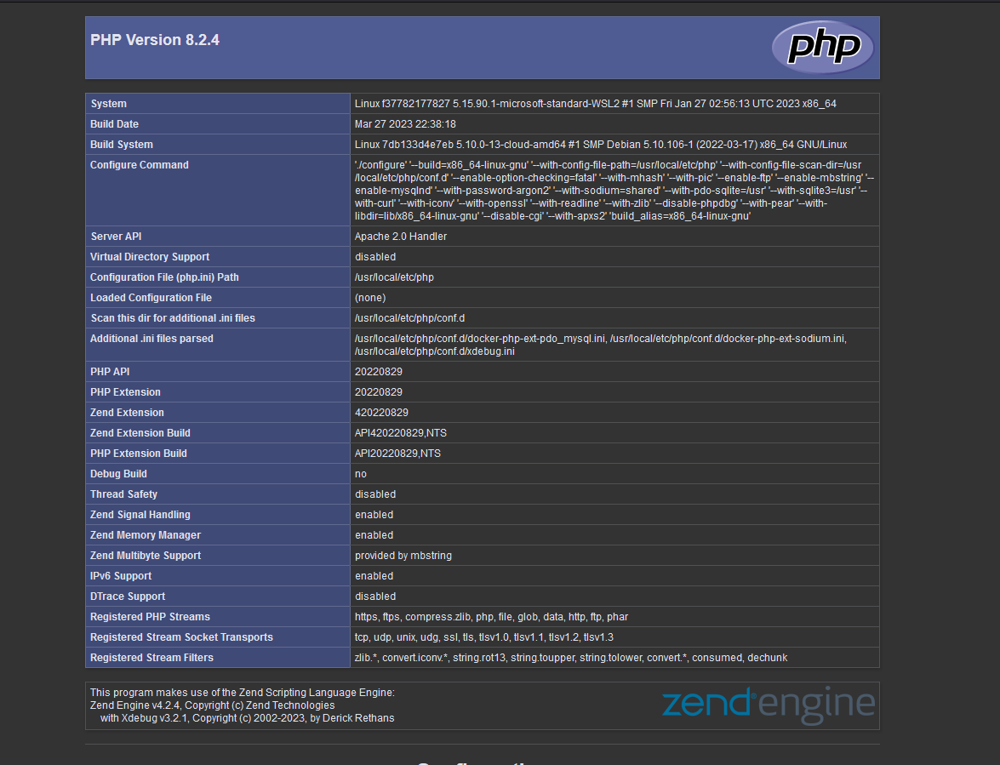
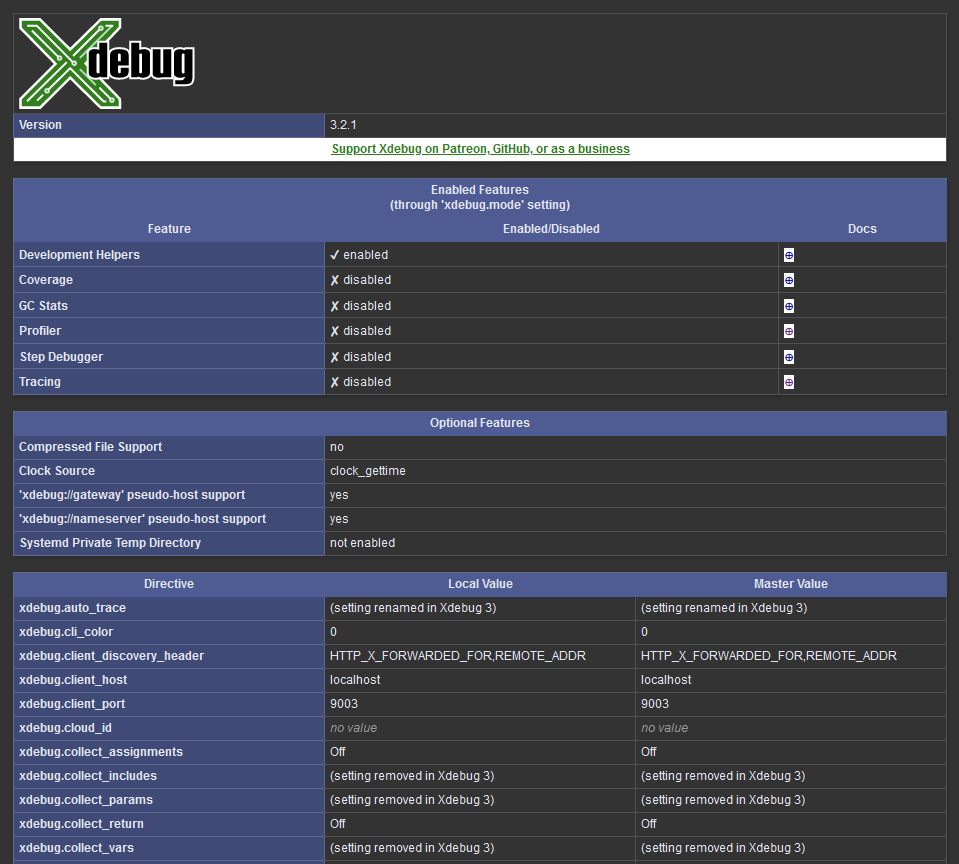

# Docker-SaeS4

## 1. Installation de docker sous windows 
<br>

Installation de [Docker Desktop](https://docs.docker.com/desktop/install/windows-install/)
<br>

## 2. Configuration des serveurs

<br>

Création d'un dossier docker à la racine du projet ainsi que d'un fichier docker dans ce dossier afin d'y mettre le dossier docker-compose.yml. Ce dossier va contenir l'ensemble des conteneurs nécessaire pour la virtualisation.

<br>


#### 2.1. Mise en place du fichier compose 
<ol>
Installation de PHP et Apache : 

<ol>
<li> Ajout de l'image 'php:8.2-apache' dans le fichier compose</li>
<li> Création des volumes nécessaires pour le service Apache et PHP. En particulier un créée les volumes suivants : <br>
- le volume html pour les informations du projet <br>
- le php.ini de apache <br>
- le fichier sitiers_enabled qui contient des informations sur apache</li>
<li>
On défini le port du conteneur d'apache -> 8080:80 
</li>
<li>
On défini le network du conteneur qu'on a nommé sae-network
</li>
</ol>
</ol>

<br>

``` yaml
apache:
    image: php:8.2-apache
    container_name: 'apache'
    volumes:
      - ./apache/html:/var/www/html/
      - ./apache/sites_enabled:/etc/apache2/sites_enabled
      - ./apache/php/custom-php.ini:/use/local/etc/php/conf.d/custom-php.ini
    ports:
      - "8080:80"
    networks:
      - sae-network

```

<br>

Installation de Postgres : 
<ol>
<li>On fait la même chose pour postgres, le SGBD qu'on utilise</li>
<li>On doit aussi configurer l'environnement pour donner les données nécessaires au conteneur, ici un login, un mot de passe et le nom de la base de données. Pour des raisons de simplicité, nous avons tout défini à 'postgres'</li>
</ol>
</ol>

<br>

``` yaml
  postgres:
    container_name: "postgres"
    image: postgres
    environment:
      POSTGRES_USER: ${POSTGRES_USER:-postgres}
      POSTGRES_PASSWORD: ${POSTGRES_PASSWORD:-postgres}
      POSTGRES_DB: ${POSTGRES_DB:-postgres}
      PGDATA: /data/postgres
    volumes:
      - ./postgres:/data/postgres
    ports:
      - "5433:5433"
    networks:
      - postgres

```

<br>

Installation de pgamid : 
<ol>
<li>Mise en place du conteneur 'pgadmin', l'interface de gestion pour notre base de données</li>
<li>
Ici, pour l'environnement, on lui passe un email, un mot de passe, et on mets à False le config serveur mode.</li>
</ol>
</ol>

<br>

``` yaml
  pgadmin:
    container_name: pgadmin_container
    image: dpage/pgadmin4
    environment:
      PGADMIN_DEFAULT_EMAIL: ${PGADMIN_DEFAULT_EMAIL:-pgadmin4@pgadmin.org}
      PGADMIN_DEFAULT _PASSWORD: ${PGADMIN_DEFAULT_PASSWORD:-admin}
      PGADMIN_CONFIG_SERVER_MODE: 'False'
    volumes:
      - ./pgadmin:/var/lib/pgadmin
    ports:
      - "${PGADMIN_PORT:-5050}:80"
    networks:
      - postgres
    restart: unless-stopped

```

Afin de connecter les conteneurs entre eux et au monde  extérieur, on utilise le type de réseau Docker par défaut : bridge
On a nommé ce réseau sae-network. 

Désormais, grâce à notre fichier compose, nous pouvons lancer notre site web SAE grâce à apache.
Nous allons désormais créer des fichiers "dockerfile" afin d'y indiquer les inscrutions à exécuter pour chaque image.

<br>

On crée donc des dockerfile pour les conteneurs apache et postgres.

On commence par créer le dockerfile pour apache.

``` yaml
FROM php:7.0-apache

RUN docker-php-ext-install pdo pdo_mysql

RUN yes | pecl install xdebug \
    && echo "zend_extension=$(find /usr/local/lib/php/extensions/ -name xdebug.so)" > /usr/local/etc/php/conf.d/xdebug.ini \
    && echo "xdebug.remote_enable=on" >> /usr/local/etc/php/conf.d/xdebug.ini \
    && echo "xdebug.remote_autostart=off" >> /usr/local/etc/php/conf.d/xdebug.ini

COPY php.ini /usr/local/etc/php/
COPY . /var/www/html/

```

Ce dockerfile contient l'extension Xdebug pour PHP.


Nous allons créer un index.php contenant le code : 

``` php

<?php
phpinfo();

```

Nous obtenons les informations suivantes : 





Nous remarquons donc que Xdebug est bien installé.


Nous créons ensuite le dockerfile pour postgres.


``` yaml

FROM postgres

RUN apt-get update \
    && apt-get install wget -y \
    && apt-get install postgresql-12-postgis-3 -y \
    && apt-get install postgis -y

COPY ./sql/create_tables.sql /docker-entrypoint-initdb.d/

```

